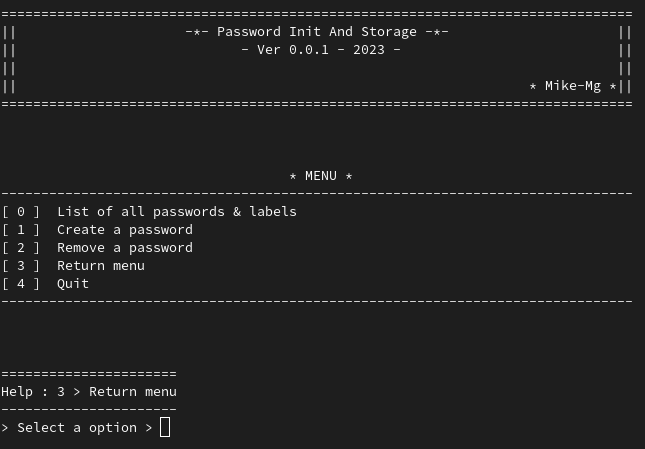

# Password Init And Storage
## Application to manage passwords in a database.
### Installation & launch :
- **Clone the repository**   
`git clone https://github.com/Mike-mg/Password_Init_And_Storage.git`
####
- **Go to the Password_Init_And_Storage folder**
####
- **Creating a working environment**  
`python -m venv env`
####
- **Activate the work environment**  
`source env/bin/activate`
####
- **Installation of the necessary modules**  
`pip install -r requirements.txt`
####
- **To disable the working environment**  
`deactivate`
***
# Running the program
- **Run the program with the following command**  
`python main.py`
####
- **A menu appears, select the desired option  (see below)** 

  
####
- **Menu Options**  
0. Allows to display all the passwords in database
1. Create a new password into database
2. Remove a of password into database
3. Back to main menu
4. Quit the program 